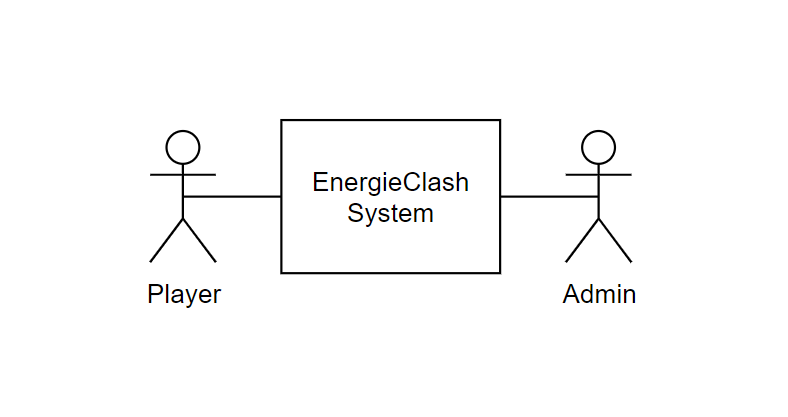

[[section-system-scope-and-context]]
== Kontextabgrenzung

[role="arc42help"]

Dieser Abschnitt beschreibt das Umfeld unseres Systems. Es soll beschreiben, wie die Schnittstellen mit Benutzer/-innen und Fremdsystemen aussehen.

=== Fachlicher Kontext

[role="arc42help"]
****

.Player
EnergieClash wird zu zweit gespielt. Ein/-e Spieler/-in spielt als Energieverschwender/-in gegen eine/-n andere/-n Spieler/-in als EnergieSparer. Dabei lesen sie Texte auf dem Bildschirm und interagieren mit den Knöpfen

.Admin
Das Spiel EnergieClash soll von Administratoren verwaltet werden können. Durch das einstecken von Maus und Tastatur erhält der Admin Zugang zum Innenleben des System. Man kann Verschiedene Parameter konfigurieren und die CRUD-Operationen für die Fragen ausführen.
****
=== Technischer Kontext

[role="arc42help"]
****
Da es keine Fremdsysteme, wie APIs oder ähnliches gibt, gibt es keine technischen Schnittstellen.
****

