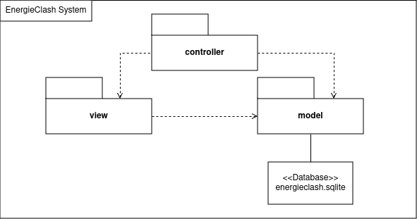
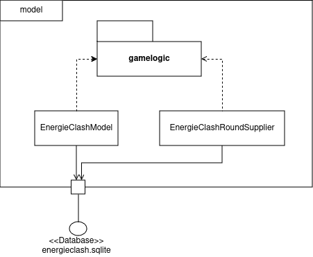
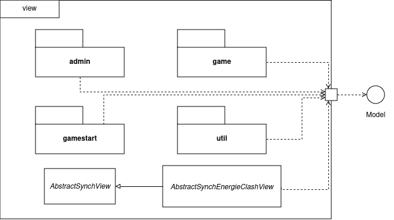
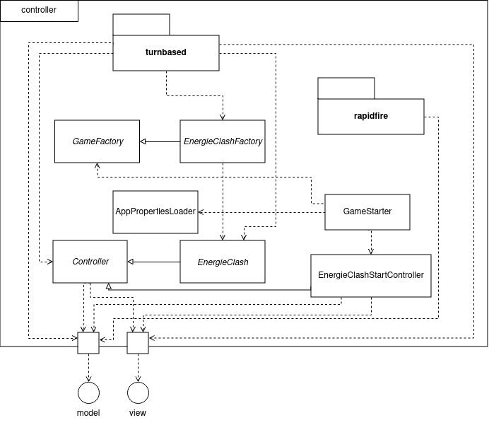
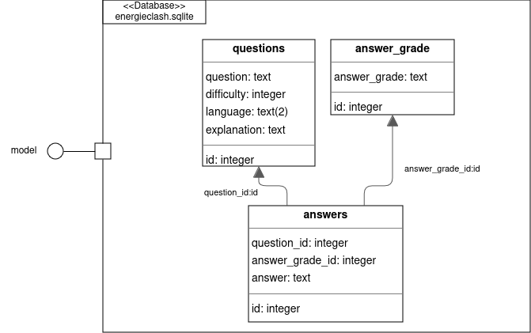
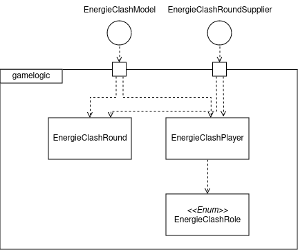

[[section-building-block-view]]
== Bausteinansicht

[role="arc42help"]

=== Ebene 0
****
.Kontextebene
Systemabgrenzung

****

=== Ebene 1

****
.EnergieClash System
Das System von EnergieClash ist nach dem Model-View-Controller Konzept aufgebaut. Das MVC-Konzept ermöglicht eine klare Trennung der Komponenten.

[cols="1,2" options="header"]
|===
| **Name** | **Verantwortung**
| controller | Erstellt Instanzen des Spiels für den jeweiligen Spielmodus und enthaltet die Starter-Klasse. Steuert Interaktionen zwischen den "model"- und "view"-Klassen.
| view | Instanziiert die physischen Buttons zur Nutzereingabe und enthaltet die verschiedenen Ansichten der GUI.
| model |Stellt die Verbindung zur Datenbank "energieclash.sqlite" her und stellt die Daten den "view"- und "controller"-Klassen zur Verfügung. Beinhaltet ausserdem die Spiellogik.
|energieclash.sqlite|Datenbank für die Spielinhalte (Fragen, Antworten, etc...).
|===
****
=== Ebene 2
****
.model
Im Model werden die Spielkonzepte definiert und es liefert die Daten für die Spielrunden.

[cols="1,2" options="header"]
|===
| **Name** | **Verantwortung**
| gamelogic | Die Spiellogik definiert Spielrollen, Spieler, Spielrunde, Schwierigkeit und Punktevergabe.
| EnergieClashModel| Anbindung an die Datenbank. Stellt Methoden für die Interaktion mit der Datenbank zur Verfügung.
| EnergieClashRoundSupplier| Stellt die Spielrunden zur Verfügung.
|===

'''
.view
Beinhaltet die verschiedenen Ansichten des Spiels und stellt die physischen Eingabegeräte zur Verfügung.

[cols="1,2" options="header"]
|===
| **Name** | **Verantwortung**
| admin | Ansichten der Admin-View für Änderungen an Spielinhalten in der Datenbank
| game | Die verschiedenen Ansichten des Spiels
| gamestart | Ansichten zur Auswahl des Spielmodis, Schwierigkeit und des Tutorials
| util | Stellt die Buttons zur Verfügung
|AbstractSynchView| Bietet Methode und Attribute zur Synchronisation beider Spieler mit dem Zustand "readyToMoveOn"
|AbstractSynchEnergieClashView| Ermöglicht es den Views den Spieler und die Buttons zuzuweisen. Die View-Klassen aus dem "game"- und "gamestart"-Package erben von dieser Klasse.
|===

'''
.controller
Erstellt Instanzen des Spiels Anhand der ausgewählten Spielmodi und Spieleinstellungen("Properties"). Startet die Applikation.

[cols="1,2" options="header"]
|===
| **Name** | **Verantwortung**
|rapidfire| Klassen aus dem "rapidfire"-Package erstellen Instanzen des rapidfire Spielmodus
|turnbased| Klassen aus dem "turnbased"-Package erstellen Instanzen des rundenbasierten Spielmodus
|_GameFactory_ | Speichert die "Properties", also die Spieleinstellungen, die zum Erstellen von Spielinstanzen benötigt werden
|_EnergieClashFactory_| Factory zum Erstellen von Spielinstanzen mit einem dazugehörigen EnergieClashModel. Klassen aus dem "turnbased"-Package erben von "EnergieClashFactory"
|AppPropertiesLoader|Lädt die Spieleinstellungen aus dem "app.properties"-File
| GameStarter | Startet die Applikation, instanziiert die Properties und stellt die Stages zur Verfügung
|Controller| Enthält beide Stages (für beide Bildschirme), beide Spielrollen und die Spracheinstellungen. Erstellt eine neue Instanz des EnergieClashModel
|_EnergieClash_| Speichert die Runden, die aktuelle Runde und die Schwierigkeitseinstellung
|EnergieClashStartController|Controller für die Auswahl des Spielmodus, des Schwierigkeitsgrads und der Funktionalität des Admins.
|===

'''
.energieclash.sqlite
Ansicht der Datenbank-Tabellen.

[cols="1,2" options="header"]
|===
| **Name** | **Verantwortung**
| questions | Die Tabelle questions beinhaltet die Fragen des Spiels.
| answer_grade | Die Tabelle answer_grade beinhaltet die verschiedenen Gewichtungsstufen der Antworten.
| answers | Die Tabelle answers beinhaltet die Antworten zu entsprechenden Fragen.
|===
****

=== Ebene 3
****
.gamelogic
In diesem Package ist die Logik der Spielkonzepte definiert.

[cols="1,2" options="header"]
|===
| **Name** | **Verantwortung**
| EnergieClashRound | Eine Spielrunde bestehend aus: einer id, einer Frage, Möglichen Antworten, dem Schwierigkeitsgrad, der Spracheinstellung und der Erklärung zur Frage.
|EnergieClashPlayer| Enthaltet die Spielrolle("EnergieClashRole") und die Punktzahl.
|EnergieClashRole| Definiert die beiden Spielrollen "waster" und "saver". Passt das Bewertungsraster der möglichen Antworten den beiden Spielrollen an.
|===
****