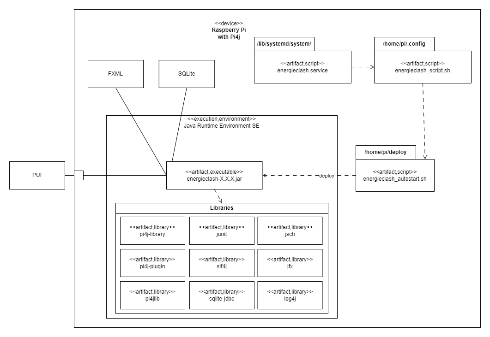

[[section-deployment-view]]
== Verteilungssicht

[role="arc42help"]
****
In diesem Abschnitt wird die technische Infrastruktur beschrieben.

****
=== Software-Voraussetzungen:
****
* Pi4J OS Version 2.4.0 oder höher.
* Java Runtime Environment SE Version 17 oder höher.
* JavaFX Version 17 oder höher.
****
=== Hardware-Voraussetzungen:
****
* Raspberry Pi 4 (Empfehlung: mehr als 1GB RAM)
* 2 Bildschirme mit HDMI (Auflösung: 1920x1080 30+Hz)
* 10 Buttons
* 20 LEDs
* 3 Kit I2C GPIO Extensions
****
****
.Autostart
"energieclash-X.X.X.jar" enthält den kompilierten Java Sourcecode mit sämtlichen Abhängigkeiten, welche beim Remote-Deploy übergeben werden. Das PUI, das FXML und die SQLite Datenbank werden hier benutzt.

"energieclash.service" wird bei Systemstart automatisch gestartet und führt "energieclash_script.sh" aus.

Dieses Skript gibt dem "energieclash_autostart.sh"-Skript Execute-Rechte und wird ebenfalls ausgefüht.

"energieclash_autostart.sh" startet die JVM mit EnergieClash.

'''
Dies wird deswegen gemacht, da man in Services unter systemd üblicherweise nicht mehrere Befehle ausführt, sondern wie hier auf andere Skripts verweist. Deshalb haben wir ein Middleman-Skript, das das Autostart-Skript, welches bei einem Remote-Deploy mit SCP auf das Raspberry Pi kopiert wird, ausführt.
****
Alles liegt auf demselben Rechner nur beim ersten Remote-Deploy braucht es weitere Schritte (siehe link:../../README.adoc[README])
