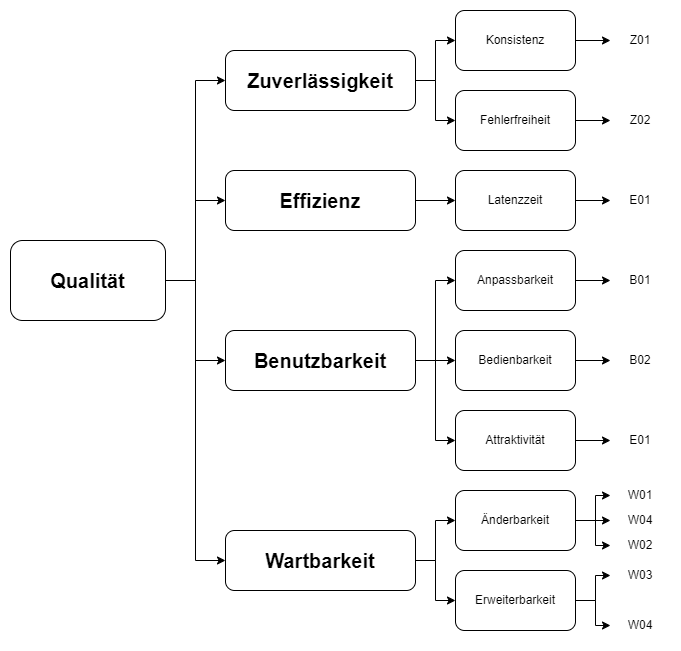

[[section-quality-scenarios]]
== Qualitätsanforderungen

=== Qualitätsbaum
****

****
=== Qualitätsszenarien
****
In diesem Abschnitt werden die Qualitätsszenarien beschrieben.

[cols="1,2" options="header"]
|===
|ID  | Szenario
| Z01  | Nach 50 gespielten Runden funktioniert das Spiel gleich schnell und fehlerlos wie bei der ersten Runde.
| Z02  | Das Spiel akzeptiert nur gültige Eingaben und werden richtig verarbeitet.
| E01  | Nach Drücken eines Knopfs antwortet das System nach maximal einer halben Sekunde.
| B01  | Beim Start des Spiels können die Spieler entscheiden, welchen Spielmodus und auf welchem Schwierigkeitsgrad sie spielen möchten.
| B02  | Die Bedienung und Benutzeroberfläche ermöglichen neuen Spielern nach einer Minute problemlos ein Spiel zu beginnen.
| W01  | Ein erfahrerer Java-Entwickler möchte eine Änderung am Spiel vornehmen. Dank der SAD und den JavaDoc-Kommentaren benötigt er, inklusive des Einlesens, maximal zwei Tage.
| W02  | Ein Administrator des Spiels möchte das Spiel konfigurieren. Dank der SAD und den Kommentaren in der Konfigurations-Datei benötigt er maximal fünf Minuten.
| W03  | Ein erfahrener Java-Entwickler möchte einen neuen Spielmodus hinzufügen. Dank der SAD, den JavaDoc-Kommentaren und der abstrakten Code-Struktur benötigt er maximal eine Woche.
| W04  | Ein Administrator des Spiels möchte Spielfragen hinzufügen, löschen oder anpassen. Dank des integrierten Admin-Dashboards kann er das in 15 Minuten erledigen.
|===
****

