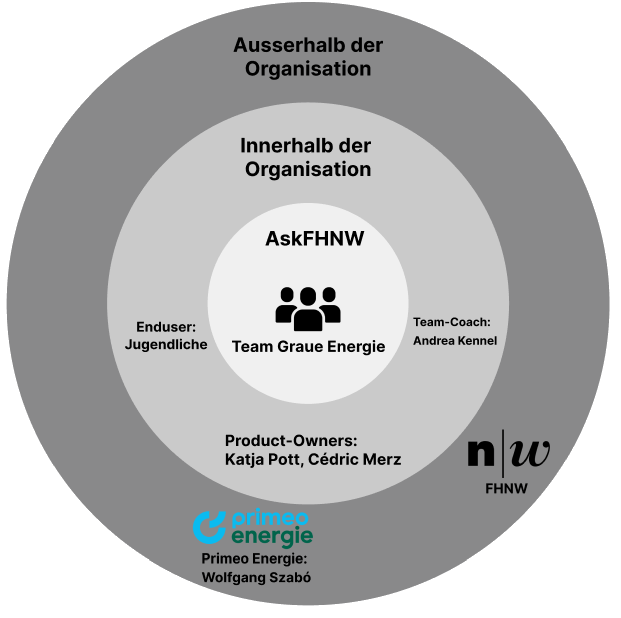

= Systemidee
Als Grundlage Ihrer Entwurfstätigkeiten sollten Sie eine Vorstellung wichtiger Systemeigenschaften und Anforderungen besitzen und mindestens folgende Fragen über das System beantwortet haben.

Umfang dieses Dokuments 1-3 A4 Seiten.

== Kernaufgabe des Systems

****
Energie-Clash ist ein pädagogisches Spiel, das das Bewusstsein für graue Energie schafft, indem es die Spieler/-innen in einem rundenbasierten 1-gegen-1-Wettbewerb entweder als Energie-Verschwender oder als Energie-Sparer gegeneinander antreten lässt.

Das Ziel des Spiels ist es, durch gezielte Fragen und informatives Feedback, Wissen über graue Energie und Energieeinsparungsmöglichkeiten zu vermitteln und das Engagement der Spieler/-innen zu fördern.
****

== Kategorie von System

****
Energie-Clash ist ein eingebettetes System, das spezifische Hardware zur Umsetzung eines interaktiven Spiels verwendet und sowohl die Hardware- als auch die Softwareaspekte eng verzahnt.

'''

*Verzahnung mit spezieller Hardware:* Das Spiel wird auf einem Raspberry Pi implementiert und erfordert spezifische Hardwarekomponenten wie Bildschirme, Buttons und LEDs.

*Interaktive Benutzerschnittstelle:* Das System interagiert direkt mit den Benutzern durch physische Eingabegeräte (Knöpfe) und eine grafische Benutzeroberfläche.

*Konfigurierbarkeit und Wartung:* Administratoren können das System über USB-Anschlüsse konfigurieren und warten, was typisch für eingebettete Systeme ist.

****

== Wesentliche Qualitätsanforderungen

****
In unserem Projekt "Energie-Clash" legen wir besonderen Wert auf die folgenden Qualitätsmerkmale:

'''

*Benutzerfreundlichkeit*

Erläuterung: Das Spiel soll die Vermittlung grauer Energie so einfach und spielerisch gestalten.
Es soll attraktiv sein und nur die nötigsten Benutzereingaben erfordern.

- Einfachheit der Bedienung: Intuitive Benutzeroberfläche mit klaren Anweisungen und minimaler Notwendigkeit für Eingaben.
- Attraktivität: Ansprechendes Design

*Wartbarkeit*

Erläuterung: Da dieses Spiel auch an Dritte weitergegeben werden soll, muss es ohne großen Aufwand konfiguriert und gewartet werden können.

- Klare Code-Struktur: Modularisierung des Codes, Trennung von Geschäftslogik, UI und Hardwareinteraktionen.
- Einfache Konfiguration: Konfigurationsparameter in einer leicht zugänglichen Properties-Datei.
- Dokumentation: Ausführliche Kommentierung des Codes und Erstellung einer Entwicklerdokumentation.

*Zuverlässigkeit*

Erläuterung: Das Spiel soll frei von möglichen Fehlerquellen und Bugs sein und seinen Zweck, Wissen zu vermitteln, zuverlässig erfüllen.

- Fehlerfreiheit: Umfassendes Testen aller Funktionen, sowohl manuell als auch automatisiert.
- Stabilität: Exception Handling und Logging zur Überwachung und Fehlerbehebung.

*Low Latency*

Erläuterung: Das Spiel soll eine geringe Antwortzeit haben, damit das Interesse der Spieler/-innen erhalten bleibt.

- Optimierung der Performance
- Schnelle Reaktionszeit
****

== Relevante Stakeholder

****
Folgende Rollen sind interessiert am System:

'''

* Enduser (Jugendliche)
* Primeo Energie
* Teamcoach
* Product Owner
* Team Graue Energie

****

== Schnittstellen zu externen Systemen

****
Da es keine Fremdsysteme, wie APIs oder ähnliches gibt, gibt es keine technischen Schnittstellen.
****